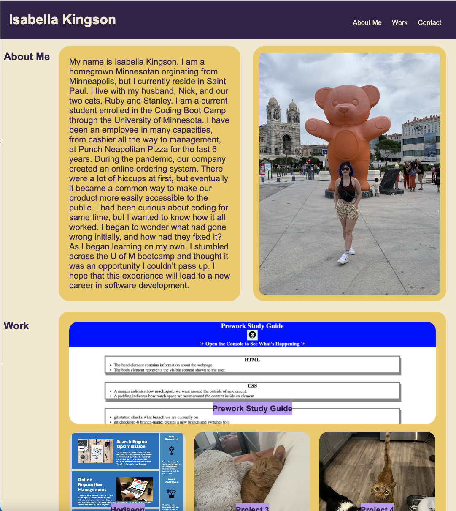

# My Portfolio

## Description

I built this project as a way to introduce myself and to show my work to future employers. Through this project I learned advanced applications of CSS and especially the use of media queries for optimized accessibility from a variety of devices. I practiced the steps to build a webpage from scratch and the git flow process.

## Installation

To view this application simply follow this link to the deployed project or copy and paste it into you web browser: https://isabellakingson.github.io/my-portfolio/

## Usage

This is a site meant for future employers to learn more about me and to view my previous work.

## Credits

I had help from my tutor Alistair Rowden.
